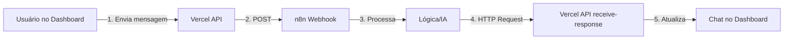

# 🚀 Configuração n8n - PRODUÇÃO

## ✅ Seu Site no Vercel
```
https://churn-dashboard-six.vercel.app
```

---

## 📤 URL para n8n Enviar Respostas

### **USAR NO HTTP REQUEST NODE:**
```
https://churn-dashboard-six.vercel.app/api/webhooks/receive-response
```

---

## ⚙️ Configuração Completa do Workflow n8n

### **Node 1: Webhook** (Receber do Dashboard)
- **URL:** `https://n8n.aegmedia.com.br/webhook-test/0021ec91-5f4b-4168-9b68-b6e1cd9caddf`
- **Method:** POST
- **Response Mode:** Immediately

---

### **Node 2: HTTP Request** (Enviar de Volta para Dashboard)

#### Configuração:
- **Method:** POST
- **URL:** `https://churn-dashboard-six.vercel.app/api/webhooks/receive-response`
- **Authentication:** None
- **Send Query Parameters:** OFF
- **Send Headers:** ON
- **Send Body:** ON

#### Headers:
| Name | Value |
|------|-------|
| Content-Type | application/json |

#### Body Parameters (JSON):
```json
{
  "clientId": "{{ $json.data.clientId }}",
  "clientName": "{{ $json.data.clientName }}",
  "response": "Resposta processada pelo n8n",
  "status": "processed",
  "timestamp": "{{ $now.toFormat('dd/MM/yyyy HH:mm') }}",
  "source": "n8n_workflow"
}
```

#### Usando Campos Dinâmicos:
Se o webhook recebeu dados do dashboard, você pode mapear assim:

```json
{
  "clientId": "{{ $('Webhook').item.json.data.clientId }}",
  "clientName": "{{ $('Webhook').item.json.data.clientName }}",
  "response": "Sua resposta aqui - pode vir de uma AI, função, etc",
  "status": "processed",
  "timestamp": "{{ $now.toFormat('dd/MM/yyyy HH:mm') }}",
  "source": "n8n_workflow",
  "messageId": "{{ $('Webhook').item.json.data.messageId }}"
}
```

---

## 🧪 Testar Manualmente

### Via PowerShell:
```powershell
$body = @{
    clientId = "1"
    clientName = "MCI PLUS"
    response = "Teste de resposta do n8n"
    status = "processed"
    timestamp = "27/02/2026 15:00"
    source = "n8n_test"
} | ConvertTo-Json

Invoke-WebRequest `
    -Uri "https://churn-dashboard-six.vercel.app/api/webhooks/receive-response" `
    -Method POST `
    -Body $body `
    -ContentType "application/json"
```

### Via cURL:
```bash
curl -X POST https://churn-dashboard-six.vercel.app/api/webhooks/receive-response \
  -H "Content-Type: application/json" \
  -d '{
    "clientId": "1",
    "clientName": "MCI PLUS",
    "response": "Teste de resposta do n8n",
    "status": "processed",
    "timestamp": "27/02/2026 15:00",
    "source": "n8n_test"
  }'
```

---

## 📋 Fluxo Completo



### O que acontece:

1. **Usuário envia mensagem** em `https://churn-dashboard-six.vercel.app`
2. **Dashboard POST →** `https://n8n.aegmedia.com.br/webhook-test/0021ec91...`
3. **n8n processa** com sua lógica (IA, banco de dados, etc)
4. **n8n envia resposta →** `https://churn-dashboard-six.vercel.app/api/webhooks/receive-response`
5. **Chat atualiza automaticamente** em até 3 segundos

---

## 🔍 Verificar se Está Funcionando

### 1. No Dashboard:
- Acesse: https://churn-dashboard-six.vercel.app
- Clique em um cliente
- Envie uma mensagem
- A mensagem deve aparecer imediatamente

### 2. No n8n:
- Verifique os logs de execução
- Deve mostrar uma execução bem-sucedida
- Status 200 ou 201 no HTTP Request

### 3. Logs do Vercel:
- Acesse: https://vercel.com/seu-usuario/churn-dashboard-six/logs
- Deve mostrar requisições POST para `/api/webhooks/receive-response`
- Status 200

---

## ⚠️ Troubleshooting

### Resposta não chega no chat?

1. **Verifique o clientId:**
   - Deve corresponder exatamente ao ID do cliente no dashboard
   - Exemplo: "1" para MCI PLUS, "2" para TechFlow, etc.

2. **Verifique os logs do Vercel:**
   ```bash
   vercel logs --follow
   ```

3. **Teste diretamente:**
   ```powershell
   Invoke-WebRequest -Uri "https://churn-dashboard-six.vercel.app/api/webhooks/receive-response" -Method POST -Body '{"clientId":"1","response":"teste"}' -ContentType "application/json"
   ```

4. **Verifique no n8n:**
   - HTTP Request node deve retornar status 200
   - Se retornar erro 404/500, verifique a URL

---

## 📊 IDs dos Clientes

| Cliente | ID |
|---------|-----|
| MCI PLUS | 1 |
| TechFlow | 2 |
| DataCorp | 3 |
| CloudSync | 4 |
| NetSolutions | 5 |

Sempre use o ID correto no campo `clientId`.

---

## ✅ Checklist Final

- [ ] URL do n8n ativa: `https://n8n.aegmedia.com.br/webhook-test/0021ec91...`
- [ ] HTTP Request node configurado: `https://churn-dashboard-six.vercel.app/api/webhooks/receive-response`
- [ ] Workflow n8n está ATIVO (toggle verde)
- [ ] Campo `clientId` mapeado corretamente
- [ ] Content-Type header: `application/json`
- [ ] Testado manualmente e funcionando

---

## 🎯 Exemplo Real de Payload n8n

Quando o dashboard envia para o n8n:
```json
{
  "event": "chat.message_sent",
  "timestamp": "2026-02-27T15:00:00.000Z",
  "data": {
    "clientId": "1",
    "clientName": "MCI PLUS",
    "clientEmail": "contact@mciplus.com.br",
    "clientPhone": "+55 41 99123-4567",
    "message": "Olá, preciso de ajuda",
    "senderName": "Support Team",
    "sender": "support",
    "messageTimestamp": "27/02/2026 15:00"
  }
}
```

O n8n deve responder enviando:
```json
{
  "clientId": "1",
  "clientName": "MCI PLUS",
  "response": "Olá! Como posso ajudá-lo?",
  "status": "processed",
  "timestamp": "27/02/2026 15:01",
  "source": "n8n_workflow"
}
```

---

## 🔗 Links Úteis

- **Dashboard:** https://churn-dashboard-six.vercel.app
- **API Receive:** https://churn-dashboard-six.vercel.app/api/webhooks/receive-response
- **Webhook n8n:** https://n8n.aegmedia.com.br/webhook-test/0021ec91-5f4b-4168-9b68-b6e1cd9caddf
- **Vercel Logs:** https://vercel.com (Settings → Logs)

---

**🎉 Pronto para produção!** Configure o n8n com essas URLs e teste.
