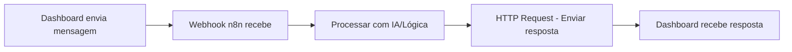

# 🔄 Configurar n8n para Responder

## 📍 URLs do Webhook

### **Desenvolvimento Local:**
```
POST http://localhost:3000/api/webhooks/receive-response
```

### **Produção (Vercel):**
```
POST https://seu-projeto.vercel.app/api/webhooks/receive-response
```

---

## 📤 Payload para Enviar do n8n

O n8n deve fazer um POST com este JSON:

```json
{
  "messageId": "msg_123",
  "clientId": "1",
  "clientName": "MCI PLUS",
  "status": "processed",
  "response": "Sua resposta processada pelo n8n",
  "timestamp": "27/02/2026 14:30",
  "source": "n8n_workflow"
}
```

### Campos:
- **clientId** (obrigatório): ID do cliente
- **clientName** (opcional): Nome do cliente
- **response** (opcional): Mensagem de resposta
- **messageId** (opcional): ID da mensagem original
- **status** (opcional): Status do processamento
- **timestamp** (opcional): Data/hora
- **source** (opcional): Origem (ex: "n8n_workflow")

---

## ⚙️ Configuração no n8n

### 1. No Workflow do n8n:

**Node 1: Webhook (Receber mensagem do Dashboard)**
- Method: POST
- Path: `/webhook-test/0021ec91-5f4b-4168-9b68-b6e1cd9caddf`
- Response Mode: Immediately

**Node 2: Processar (sua lógica)**
- Function, AI, Database, etc.

**Node 3: HTTP Request (Enviar resposta de volta)**
- Method: POST
- URL: `http://localhost:3000/api/webhooks/receive-response`
  - **OU** `https://seu-projeto.vercel.app/api/webhooks/receive-response`
- Headers:
  ```json
  {
    "Content-Type": "application/json"
  }
  ```
- Body (JSON):
  ```json
  {
    "clientId": "{{ $json.data.clientId }}",
    "clientName": "{{ $json.data.clientName }}",
    "messageId": "{{ $json.data.messageId }}",
    "response": "{{ $processedResponse }}",
    "status": "processed",
    "timestamp": "{{ $now.toISO() }}",
    "source": "n8n_workflow"
  }
  ```

---

## 📊 Exemplo Completo do Workflow n8n



### Configuração Detalhada:

#### **Node 1: Webhook**
```
Name: Receive Message from Dashboard
Webhook URL: https://n8n.aegmedia.com.br/webhook-test/0021ec91-5f4b-4168-9b68-b6e1cd9caddf
HTTP Method: POST
Response Mode: Immediately
Response Code: 200
Response Data: 
{
  "success": true,
  "message": "Message received by n8n"
}
```

#### **Node 2: Function/AI/Process**
```
Name: Process Message
// Sua lógica aqui
// Exemplo: chamar OpenAI, processar dados, etc.
```

#### **Node 3: HTTP Request**
```
Name: Send Response to Dashboard
Method: POST
URL: http://localhost:3000/api/webhooks/receive-response

Headers:
Content-Type: application/json

Body:
{
  "clientId": "{{ $('Receive Message from Dashboard').item.json.data.clientId }}",
  "clientName": "{{ $('Receive Message from Dashboard').item.json.data.clientName }}",
  "response": "Resposta processada pelo n8n",
  "status": "processed",
  "timestamp": "{{ $now.toISO() }}",
  "source": "n8n_workflow"
}
```

---

## 🧪 Testar Localmente

### 1. Inicie o servidor:
```bash
npm run dev
```

### 2. No n8n, use esta URL para teste local:
```
http://localhost:3000/api/webhooks/receive-response
```

⚠️ **Importante:** Se o n8n estiver em um servidor diferente, você precisará:
- Expor sua API local (usando ngrok, localtunnel, etc.)
- Ou fazer deploy no Vercel primeiro

### Usando ngrok para testes locais:
```bash
# Instalar ngrok
# Depois executar:
ngrok http 3000

# Use a URL gerada no n8n:
https://abc123.ngrok.io/api/webhooks/receive-response
```

---

## 🚀 Configurar para Produção (Vercel)

### 1. Após fazer deploy no Vercel:
Sua URL será algo como:
```
https://churn-dashboard-xyz.vercel.app
```

### 2. No n8n, atualize o HTTP Request node:
```
URL: https://churn-dashboard-xyz.vercel.app/api/webhooks/receive-response
```

### 3. Variável de Ambiente no n8n (Opcional):
Crie uma variável no n8n:
```
DASHBOARD_URL=https://churn-dashboard-xyz.vercel.app
```

E use:
```
URL: {{ $env.DASHBOARD_URL }}/api/webhooks/receive-response
```

---

## ✅ Testar a Resposta

### Via PowerShell:
```powershell
$body = @{
    clientId = "1"
    clientName = "Teste Cliente"
    response = "Resposta de teste do n8n"
    status = "processed"
    source = "n8n_test"
    timestamp = (Get-Date).ToString("dd/MM/yyyy HH:mm")
} | ConvertTo-Json

Invoke-WebRequest `
    -Uri "http://localhost:3000/api/webhooks/receive-response" `
    -Method POST `
    -Body $body `
    -ContentType "application/json"
```

### Resposta Esperada:
```json
{
  "success": true,
  "message": "Webhook response received successfully",
  "responseId": "resp_1234567890_abc123",
  "data": {
    "clientId": "1",
    "clientName": "Teste Cliente",
    "status": "processed",
    "receivedAt": "2026-02-27T14:30:00.000Z"
  }
}
```

---

## 📋 Resumo

| Ambiente | URL para n8n Enviar Resposta |
|----------|------------------------------|
| **Local** | `http://localhost:3000/api/webhooks/receive-response` |
| **Local (porta 3001)** | `http://localhost:3001/api/webhooks/receive-response` |
| **Vercel** | `https://seu-projeto.vercel.app/api/webhooks/receive-response` |

**Campo obrigatório no payload:** `clientId`

---

## 🔗 Links Relacionados

- [WEBHOOK_API.md](../WEBHOOK_API.md) - Documentação completa da API
- [FIX_WEBHOOK.md](../FIX_WEBHOOK.md) - Troubleshooting do n8n
